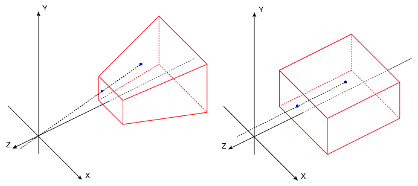

# OrthoCamera
Minecraft Fabric client-side mod. Adds Toggleable & configurable orthographic view mode.

## What is this
In the perspective view (the default), objects which are far away are smaller than those nearby. In the orthographic view, all objects appear at the same scale.

Minecraft uses perspective view to draw the world. It gives a first-person feel. 

This mod allows you to enable orthographic view and configure frustum in detail.

## Use
You can open config screen from ModMenu or by the hotkey. You can configure:
- Saving enabled state between client restarts
- X and Y camera scale
- Minimum and maximum view distance (Position of frustum's near and far plane)
- Fix camera (Lock mouse rotation. Allows to play the game normally, but with an orthographic view)
- Fixed camera rotation
- Fixed camera rotation speed (when rotating using hotkeys)

There are also 3 hotkeys for:
- Toggle orthographic view
- Increase scale
- Decrease scale
- Fix camera
- Rotate fixed camera

## Compatibility
- Using **Sodium** mod, you have to disable "Use Block Face Culling" in "Performance" tab. Otherwise, some block faces will not render with big scale
- However, **Nvidium** mod force enables this sodium feature. So you have to **disable Nvidium** mod, if you have it. 
- After disabling, you probably need to press F3 + T to apply change